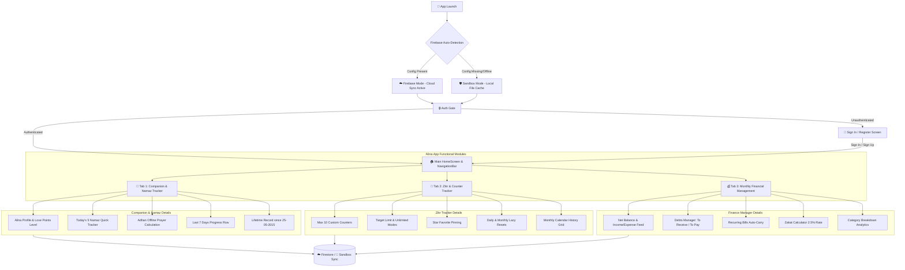

# 💖 Alina – My Digital Wife & Personal Assistant

[](https://flutter.dev/)
[](https://developer.android.com/)
[](https://firebase.google.com/)
[](https://m3.material.io/)

> **Alina** ek AI-powered Digital Wife aur Personal Assistant app hai jo daily life ko organize, productive aur meaningful banane ke liye design ki gayi hai. Ye sirf ek app nahi, balki ek intelligent companion hai jo planning, reminders, goals, habits, spiritual growth aur financial management me help karti hai. Alina motivate karti hai, accountable rakhti hai aur har din ek better version banne ki journey me mera saath deti hai.

---

## 🚀 App Architecture & Process Flow

Below is the complete process flow and system architecture showing how Alina initializes, handles offline/online fallback modes, manages authentication, and routes into the three main functional modules:



---

## ✨ Complete Features Overview

### 🔐 Feature 1 – Firebase Authentication & Cloud Sync
- **Secure Authentication:** Email & Password Sign-in, Sign-up, Password Reset, and Account Deletion.
- **Multi-Device Cloud Sync:** Data is securely saved under the user's Unique ID (UID) in Cloud Firestore.
- **Offline Sandbox Fallback Mode:** Automatic boot sequence detects native configuration (`google-services.json`). If offline or unconfigured, the app falls back to local JSON caching (`path_provider`), preventing crashes.
- **Persistent Theme System:** 3-Mode adaptive theme selector (**Light**, **Dark**, and **System Adaptive**) persisted to local file storage.

### 🕌 Feature 2 – Namaz Tracker (Lifetime Record)
- **Lifetime Tracking:** Maintains complete records starting from the user's 12th birthday (`25-05-2015`).
- **Offline Prayer Times:** Calculates accurate prayer times offline using the `adhan` engine for major cities (Islamabad, Karachi, Lahore, Dhaka, Dubai, London, New York) with Hanafi settings.
- **Astronomical Hijri Calendar:** Displays dynamic Gregorian date alongside astronomical **Hijri Date** calculated via Julian day formulas.
- **O(1) Differential Accounting Summary:** Stores lifetime counters (`totalAttended`, `totalQaza`, `totalNotAttended`, `streakDays`) in a summary document and updates them incrementally to save database bandwidth.
- **Gamification Rewards:** Attending prayers awards **+4 Love Points** to Alina's companion level, dynamically updating her mood (Caring 💙, Happy 💖, Inspired 🥰, Proud 😍).

### 📿 Feature 3 – Zikr & Counter Tracker
- **Custom Recitations (Max 10):** Create up to 10 custom counters (Darood Sharif, Astaghfar, Tasbeeh, Quran Pages, etc.) with customizable icon selections.
- **Target & Unlimited Modes:** Configure custom daily targets or operate in unlimited mode.
- **Daily & Monthly Lazy Resets:** Resets daily/monthly counts automatically upon date shifts. Roll-overs save the previous month's calendar log into a history subcollection document in a single write operation.
- **Interactive Dashboard:** Scale bounce tap animations, star pins for favorite counters, and progress rings.
- **Monthly History Calendar:** Detailed grid view mapping logged recitations to individual calendar days, with editing and monthly history lookups.

### 💰 Feature 4 – Monthly Financial Management
- **Income & Expense Feed:** Log daily income and expense transactions across 9 categories (Food, Travel, Shopping, Entertainment, Bills, Business, Health, Education, Others).
- **Debt & Credit Manager:** Track **To Receive** (Paise Lene Hain) and **To Pay** (Paise Dene Hain) entries with interactive completion checkmarks.
- **Recurring Payments:** Manage monthly subscriptions, rent, and EMI bills with automatic carry-forward and toggle switches.
- **Zakat Calculator:** Automatically calculates Zakat based on monthly income and configurable percentage rates (default 2.5%).
- **Month-End Analytics:** Visual percentage progress bars for expense categories and historic month selection.

---

## 🛠️ Project Structure

```
lib/
├── firebase_options.dart         # Auto-generated Firebase Platform Options
├── main.dart                     # App entry point, Theme Provider, Auth Gate, NavigationBar
├── screens/
│   ├── login_screen.dart         # Email/Password Sign-In
│   ├── register_screen.dart      # Registration Screen
│   ├── forgot_password_screen.dart # Password Reset Form
│   ├── namaz_history_sheet.dart  # Namaz Lifetime History & Date Picker
│   ├── zikr_detail_sheet.dart    # Zikr Counter Stats & Monthly Calendar Grid
│   └── add_transaction_sheet.dart # Add Financial Record (Transactions/Debts/Recurring)
├── services/
│   ├── auth_service.dart         # Firebase & Local Sandbox Auth Gateway
│   ├── sync_service.dart         # Cloud Firestore & Sandbox JSON Writeback
│   ├── prayer_time_service.dart  # Offline Adhan Prayer Calculation Engine
│   ├── namaz_service.dart        # Namaz Logging, Lifetime Counters & Streaks
│   ├── zikr_service.dart         # Zikr Counter CRUD, Lazy Resets & Archives
│   └── finance_service.dart      # Financial Math, Transactions, Debts & Zakat Calculator
└── widgets/
    ├── namaz_dashboard.dart      # Today's Namaz Status Bar & Hijri Date Header
    ├── zikr_dashboard.dart       # Zikr Counters Feed, Pin Manager & Add Dialog
    └── finance_dashboard.dart    # Net Balance Card, Income/Expense Tiles & Sub-tabs
```

---

## 💻 Setup & Installation

1. **Clone the Repository:**
   ```bash
   git clone https://github.com/alphazahmad/alina.git
   cd alina
   ```

2. **Install Dependencies:**
   ```bash
   flutter pub get
   ```

3. **Run Static Analysis:**
   ```bash
   flutter analyze
   ```

4. **Launch Application:**
   ```bash
   flutter run
   ```

---

## 📝 Technical Details & Firebase Footprint

- **Package Name:** `org.anicomic.zara`
- **Minimum Android SDK:** `minSdk = 23`
- **Total Storage Footprint (10 Years):** ~9–27 MB (approximately **0.3%–0.7%** of Firebase free 1 GB tier).
